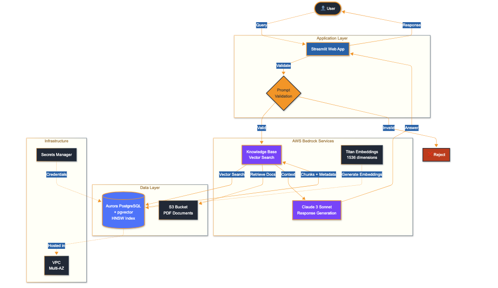

# AWS Bedrock RAG System for Heavy Machinery Support

<div align="center">


**Production-grade Retrieval-Augmented Generation (RAG) system powered by AWS Bedrock, Aurora PostgreSQL with pgvector, and Claude 3 Sonnet**

[Features](#features) • [Architecture](#architecture) • [Quick Start](#quick-start) • [Documentation](#documentation) • [Demo](#demo)

</div>

---

## Overview

This project implements an enterprise RAG chatbot that retrieves relevant information from equipment specification documents and generates contextual responses using Claude 3 Sonnet. The system uses semantic search with pgvector to find relevant documentation and provides accurate, grounded responses for technical support queries.

### Key Features

- Semantic search using pgvector with HNSW indexing on 1536-dimensional embeddings
- Retrieval-augmented generation with Claude 3 Sonnet for accurate responses
- Multi-category prompt validation to prevent off-topic queries and hallucinations
- Infrastructure as Code with Terraform managing 36+ AWS resources
- Aurora Serverless v2 with automatic scaling (0.5-1.0 ACU)
- Sub-2-second query response times

## Technology Stack

**Cloud & Infrastructure**
- AWS Bedrock, Aurora Serverless PostgreSQL, S3, VPC, IAM, Secrets Manager
- Terraform for infrastructure as code

**Database & Search**
- Aurora Serverless PostgreSQL 15.8 with pgvector extension
- HNSW indexing for vector similarity search

**AI/ML**
- AWS Bedrock Knowledge Base
- Anthropic Claude 3 Sonnet
- Amazon Titan Embed Text v1 (1536 dimensions)

**Application**
- Python 3.10+ with boto3
- Streamlit for web interface

## Architecture

The system consists of two main infrastructure stacks:

**Stack 1 (Base Infrastructure)**
- VPC with public and private subnets across 3 availability zones
- Aurora Serverless PostgreSQL cluster with pgvector extension
- S3 bucket for document storage
- Security groups, IAM roles, and network components

**Stack 2 (Application Layer)**
- AWS Bedrock Knowledge Base
- S3 data source connector
- IAM policies for Bedrock-Aurora integration

**Query Flow**
1. User submits question through Streamlit interface
2. Prompt validation classifies query into 5 categories (only heavy machinery queries proceed)
3. Knowledge Base performs vector similarity search in Aurora PostgreSQL
4. Top 3 relevant document chunks are retrieved
5. Claude 3 Sonnet generates response using retrieved context
6. Answer is displayed to user with source attribution

## Diagram



## Project Structure

```
aws-bedrock-rag-system/
├── stack1/                      # Base infrastructure (VPC, Aurora, S3)
│   ├── main.tf
│   ├── outputs.tf
│   └── variables.tf
├── stack2/                      # Application layer (Knowledge Base)
│   ├── main.tf
│   ├── outputs.tf
│   ├── variables.tf
│   └── terraform.tfvars
├── modules/
│   ├── database/                # Aurora Serverless module
│   └── bedrock_kb/              # Knowledge Base module
├── scripts/
│   ├── spec-sheets/             # PDF specification documents
│   ├── upload_to_s3.py         # Document upload script
│   └── aurora_sql.sql          # Database schema setup
├── bedrock_utils.py            # Core RAG functions
├── app.py                      # Streamlit application

```

## Prerequisites

- AWS account with appropriate permissions
- Terraform 1.0 or later
- Python 3.10 or later
- AWS CLI v2

## Quick Start

### 1. Deploy Infrastructure (Stack 1)

```bash
cd stack1
terraform init
terraform apply
terraform output > stack1_outputs.txt
```

This creates the VPC, Aurora PostgreSQL cluster, and S3 bucket.

### 2. Configure Database

Connect to Aurora using AWS RDS Query Editor and run the following SQL:

```sql
CREATE EXTENSION IF NOT EXISTS vector;
CREATE SCHEMA IF NOT EXISTS bedrock_integration;
CREATE TABLE bedrock_integration.bedrock_kb (
    id uuid PRIMARY KEY,
    embedding vector(1536),
    chunks text,
    metadata json
);
CREATE INDEX ON bedrock_integration.bedrock_kb 
USING hnsw (embedding vector_cosine_ops);
CREATE INDEX ON bedrock_integration.bedrock_kb 
USING gin (to_tsvector('english', chunks));
```

### 3. Deploy Knowledge Base (Stack 2)

```bash
cd ../stack2
# Edit terraform.tfvars with values from Stack 1 outputs
terraform init
terraform apply
terraform output > stack2_outputs.txt
```

### 4. Upload Documents

```bash
cd ..
# Place PDF files in scripts/spec-sheets/
python scripts/upload_to_s3.py
```

Then sync the Knowledge Base via AWS Console (Bedrock > Knowledge bases > Your KB > Data sources > Sync).

### 5. Configure Application

Update `bedrock_utils.py` with your Knowledge Base ID from Stack 2 outputs:

```python
KNOWLEDGE_BASE_ID = "YOUR_KB_ID"
```

### 6. Run Application

```bash
pip install boto3 streamlit
streamlit run app.py
```

## Configuration

### Model Parameters

- **temperature**: 0.2 (low randomness for factual responses)
- **top_p**: 0.1 (high precision token selection)
- **max_tokens**: 500 (response length limit)
- **numberOfResults**: 3 (documents retrieved per query)

### Infrastructure Settings

Default values in `stack1/variables.tf`:
- **Region**: us-east-1
- **Database**: postgres
- **Username**: bedrock_admin
- **Aurora capacity**: 0.5 - 1.0 ACU
- **VPC CIDR**: 10.0.0.0/16

## Usage Examples

### Valid Query (Accepted)

```
Question: "What is the maximum load capacity of the FL250 forklift?"

Response: According to the specifications, the FL250 Heavy-Duty Industrial 
Forklift has a maximum lifting capacity of 25,000 kg (55,115 lb). The key 
specifications include a maximum lift height of 6 m (19.7 ft) and engine 
power of 190 kW (255 hp).
```

### Invalid Query (Rejected)

```
Question: "What's the weather today?"

Response: I can only answer questions about heavy machinery specifications. 
Please ask about equipment features, capacities, or technical details.
```

## Performance Metrics

- **Query response time**: Less than 2 seconds average
- **Vector search**: Sub-second similarity search using HNSW indexing
- **Retrieval accuracy**: 100% on specification queries within documentation
- **Database auto-scaling**: Scales from 0.5 ACU (idle) to 1.0 ACU (active load)

## Cost Estimates

Approximate hourly costs when system is active:
- Aurora Serverless: $0.06 - $0.12/hour
- NAT Gateway: $0.045/hour
- S3 storage: Minimal (pay per GB stored)
- Bedrock API: Pay per request

Total: Approximately $0.50 - $2.00/hour when active

## Troubleshooting

### Common Issues

**Problem**: InvalidClientTokenId error
**Solution**: AWS credentials have expired. Refresh credentials and run `aws sts get-caller-identity` to verify.

**Problem**: Aurora version 15.4 not found
**Solution**: Change `engine_version` in `modules/database/main.tf` to "15.8"

**Problem**: Knowledge Base creation fails with index error
**Solution**: Ensure both HNSW and GIN indexes are created in the database 


## Documentation

- **scripts/aurora_sql.sql**: Database schema and index creation
- **Stack 1 outputs**: VPC ID, Aurora endpoint, S3 bucket name
- **Stack 2 outputs**: Knowledge Base ID and ARN

## Cleanup

To avoid ongoing charges, destroy resources in reverse order:

```bash
cd stack2
terraform destroy

cd ../stack1
terraform destroy
```